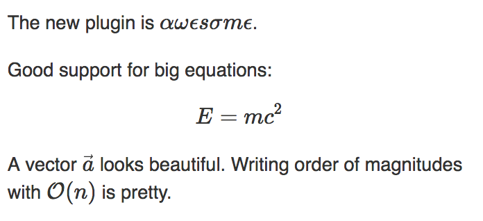

# pelican-jsmath

This plugin passes math through the parsers without modifications so that a
JavaScript renderer can process it.

It adds an extension to Markdown and configures the Restructured Text
parser such that it does not break embedded math of the form `$E=mc^2$` or
`$$E=mc^2$$` and wraps these in `<div class="math">` or `<span class="math">`.

Install with `pip install pelican-jsmath`. In your `pelican-conf.py`, add

```py
import pelican_jsmath  # not the underscore here, not dash
PLUGINS = [..., pelican_jsmath, ...]  # add without quotes
```

## Use with [KaTeX](https://github.com/Khan/KaTeX)

In the `base.html` template of your theme, add

```html
<!-- KaTeX -->
<link rel="stylesheet" href="https://cdnjs.cloudflare.com/ajax/libs/KaTeX/0.9.0-beta1/katex.min.css" integrity="sha384-VEnyslhHLHiYPca9KFkBB3CMeslnM9CzwjxsEbZTeA21JBm7tdLwKoZmCt3cZTYD" crossorigin="anonymous" />
<script src="https://cdnjs.cloudflare.com/ajax/libs/KaTeX/0.9.0-beta1/katex.min.js" integrity="sha384-O4hpKqcplNCe+jLuBVEXC10Rn1QEqAmX98lKAIFBEDxZI0a+6Z2w2n8AEtQbR4CD" crossorigin="anonymous"></script>
<script src="https://cdnjs.cloudflare.com/ajax/libs/KaTeX/0.9.0-beta1/contrib/auto-render.min.js" integrity="sha384-IiI65aU9ZYub2MY9zhtKd1H2ps7xxf+eb2YFG9lX6uRqpXCvBTOidPRCXCrQ++Uc" crossorigin="anonymous"></script>
```

to the `<head>` and at the bottom, add
`<script>renderMathInElement(document.body);</script>`.

### Sample




## Attribution

Parts of the custom Markdown Extension are adopted from the
[render_math](https://github.com/barrysteyn/pelican_plugin-render_math) plugin.
